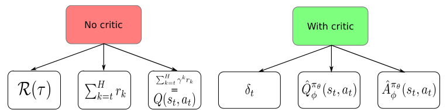

### The policy search problem
We want to optimize $J(\theta)=\mathbb{E}_{\tau \sim \pi_{\theta}}[R(\tau)]$, where we tune the policy parameters $\theta$, thus the goal it so find,
$$
	\theta^* = \arg \max_{\theta} J(\theta) = \arg \max_{\theta} \sum_{\tau} P(\tau|\theta)R(\tau)
$$
where $P(\tau|\theta)$ is the probability of trajectory $\tau$ under policy $\pi_{\theta}$. This direct policy search is black box optimization, in short a function $f(x): \mathbb{R}^n \rightarrow \mathbb{R}$ for which the analytic form is not know. One way of finding a minimum is by approximating the gradient for $f(x)$. In policy search this can be done by the *Policy Gradient Theorem*.

The general idea is to increase $P(\tau|\theta)$ for trajectories $\tau$ with a high return. Doing so by following gradient ascent from the analytical knowledge that is gathered. Now as we have access to the state, action and reward at each step, we're not applying black-box optimization anymore. However, the transition and reward functions are still unknown (gray-box).

**Policy Gradient Theorem**
Hence by looking for parameters $\theta^{*}= \arg \max_{\theta} J(\theta)$ we look for the gradient,
$$
\begin{align}
\nabla_{\boldsymbol{\theta}} J(\boldsymbol{\theta}) &=\nabla_{\boldsymbol{\theta}} \sum_{\tau} P(\tau \mid \boldsymbol{\theta}) R(\tau) \\
&\text{The gradient of sum, is the sum of the gradients} \\
&=\sum_{\tau} \nabla_{\boldsymbol{\theta}} P(\tau \mid \boldsymbol{\theta}) R(\tau) \\
&\text{Multiply by one} \\
&=\sum_{\tau} \frac{P(\tau \mid \boldsymbol{\theta})}{P(\tau \mid \boldsymbol{\theta})} \nabla_{\boldsymbol{\theta}} P(\tau \mid \boldsymbol{\theta}) R(\tau) \\
&=\sum_{\tau} P(\tau \mid \boldsymbol{\theta}) \frac{\nabla_{\boldsymbol{\theta}} P(\tau \mid \boldsymbol{\theta})}{P(\tau \mid \boldsymbol{\theta})} R(\tau) \\
&\text{The property of the gradient of log} \\
&=\sum_{\tau} P(\tau \mid \boldsymbol{\theta}) \nabla_{\boldsymbol{\theta}} \log P(\tau \mid \boldsymbol{\theta}) R(\tau) \\
&\text{By the definition of the expectation} \\
&=\mathbb{E}_{\tau}\left[\nabla_{\boldsymbol{\theta}} \log P(\tau \mid \boldsymbol{\theta}) R(\tau)\right]
\end{align} 
$$
We want to compute the expectation but don't have the analytical expression for $P(\tau|\theta)$. Thus, we can't compute the gradient term. Now, we look at reformulating $P(\tau|\theta)$ using the policy $\pi_{\theta}$. The probability of a trajectory by the policy for a horizon $H$ can be written as, 
$$
P(\tau|\theta) = \Pi^{H}_{t=1}p(s_{t+1}|s_t, a_t)\cdot\pi_{\theta}(a_t|s_t)
$$
Note, that the markov assumption is used here, this statement hoplds if the steps are independent. Hence, under the Markov assumption,
$$
\begin{align}
\nabla_{\boldsymbol{\theta}} \log \mathrm{P}(\tau, \boldsymbol{\theta}) &=\nabla_{\boldsymbol{\theta}} \log \left[\prod_{t=1}^{H} p\left(\mathbf{s}_{t+1} \mid \mathbf{s}_{t}, \mathbf{a}_{t}\right) \cdot \pi_{\boldsymbol{\theta}}\left(\mathbf{a}_{t} \mid \mathbf{s}_{t}\right)\right] \\
&\text{log of product is sum of logs} \\
&=\nabla_{\boldsymbol{\theta}}\left[\sum_{t=1}^{H} \log \mathrm{p}\left(\mathbf{s}_{t+1} \mid \mathbf{s}_{t}, \mathbf{a}_{t}\right)+\sum_{t=1}^{H} \log \pi_{\boldsymbol{\theta}}\left(\mathbf{a}_{t} \mid \mathbf{s}_{t}\right)\right] \\
&\text {As the first term is independent of } \boldsymbol{\theta} \\
&=\nabla_{\boldsymbol{\theta}} \sum_{t=1}^{H} \log \pi_{\boldsymbol{\theta}}\left(\mathbf{a}_{t} \mid \mathbf{s}_{t}\right)^{*} \\
&\text{Again, we can switch out the gradient and sum} \\
&=\sum_{t=1}^{H} \nabla_{\boldsymbol{\theta}} \log \pi_{\boldsymbol{\theta}}\left(\mathbf{a}_{t} \mid \mathbf{s}_{t}\right)^{*} 
\end{align}
$$
Now, the key insight is that we know $\nabla_{\theta} \log \pi_{\theta}\left(\mathbf{a}_{t} \mid \mathbf{s}_{t}\right)$. Filling in this result we obtain, 
$$
\nabla_{\boldsymbol{\theta}} J(\boldsymbol{\theta})=\mathbb{E}_{\tau}\left[\sum_{t=1}^{H} \nabla_{\boldsymbol{\theta}} \log \pi_{\boldsymbol{\theta}}\left(\mathbf{a}_{t} \mid \mathbf{s}_{t}\right) R(\tau)\right]
$$

**Naive Policy Gradient Algorithm**
This can be used for direct policy search on $J(\theta)$ to gradient ascent on $\pi_{\theta}$. The expectation can be approximated by sampling over $m$ trajectories,
$$
\nabla_{\boldsymbol{\theta}} J(\boldsymbol{\theta})=\frac{1}{m} \sum^{m}_{i=1} \sum^{H}_{t=1} \nabla_{\boldsymbol{\theta}} \log \pi_{\boldsymbol{\theta}}\left(\mathbf{a}_{t}^{(i)} \mid \mathbf{s}_{t}^{(i)}\right) R\left(\tau^{(i)}\right)
$$

This algorithm would follow the following steps,

1. Sample a set of trajectories from $\pi_{\theta}$.
2. Compute, $Loss(\theta)= -\frac{1}{m} \sum^{m}_{i=1} \sum^{H}_{t=1} \nabla_{\boldsymbol{\theta}} \log \pi_{\boldsymbol{\theta}}\left(\mathbf{a}_{t}^{(i)} \mid \mathbf{s}_{t}^{(i)}\right) R\left(\tau^{(i)}\right)$
3. Minimize the loss by back-propagating the neural network using a optimizer

*Limitations*
The limitations of this algorithm are, that we will need a large batch of trajectories or the algorithm will suffer from large variance. The sum of rewards is not much informative, when $R(\tau)=0$, the value will not change. Finally, computing $R$ from complete trajectories is not the best thing we can do. Hence in next section we consider a baseline.

**Considering a baseline**
We consider the gradient term of our objective function again, 
$$
\begin{aligned}
\nabla_{\boldsymbol{\theta}} J(\boldsymbol{\theta}) & \sim \frac{1}{m} \sum_{i=1}^{m} \sum_{t=1}^{H} \nabla_{\boldsymbol{\theta}} \log \pi_{\boldsymbol{\theta}}\left(\mathbf{a}_{t}^{(i)} \mid \mathbf{s}_{t}^{(i)}\right) R\left(\tau^{(i)}\right) \\
&\sim \frac{1}{m} \sum_{i=1}^{m} \sum_{t=1}^{H} 
\nabla_{\boldsymbol{\theta}} \log \pi_{\boldsymbol{\theta}}\left(\mathbf{a}_{t}^{(i)} \mid \mathbf{s}_{t}^{(i)}\right)\left[\sum_{t=1}^{H} r\left(\mathbf{s}_{t}^{(i)}, \mathbf{a}_{t}^{(i)}\right)\right] \\
&\text{We split up the reward} \\
&\sim \frac{1}{m} \sum_{i=1}^{m} \sum_{t=1}^{H} \nabla_{\boldsymbol{\theta}} \log \pi_{\boldsymbol{\theta}}\left(\mathbf{a}_{t}^{(i)} \mid \mathbf{s}_{t}^{(i)}\right)\left[\sum_{k=1}^{t-1} r\left(\mathbf{s}_{k}^{(i)}, \mathbf{a}_{k}^{(i)}\right)+\sum_{k=t}^{H} r\left(\mathbf{s}_{k}^{(i)}, \mathbf{a}_{k}^{(i)}\right)\right] \\
&\text{Pas rewards do not depend on the current action} \\
&\sim \frac{1}{m} \sum_{i=1}^{m} \sum_{t=1}^{H} \nabla_{\boldsymbol{\theta}} \log \pi_{\boldsymbol{\theta}}\left(\mathbf{a}_{t}^{(i)} \mid \mathbf{s}_{t}^{(i)}\right)\left[\sum_{k=t}^{H} r\left(\mathbf{s}_{k}^{(i)}, \mathbf{a}_{k}^{(i)}\right)\right] \\
&\text{Reduce the variance by discounting the rewards along the trajectory} \\
&\sim \frac{1}{m} \sum_{i=1}^{m} \sum_{t=1}^{H} \nabla_{\boldsymbol{\theta}} \log \pi_{\boldsymbol{\theta}}\left(\mathbf{a}_{t}^{(i)} \mid \mathbf{s}_{t}^{(i)}\right)\left[\sum_{k=t}^{H} \gamma^{k-t} r\left(\mathbf{s}_{k}^{(i)}, \mathbf{a}_{k}^{(i)}\right)\right]
\end{aligned}
$$

We have essentially rewritten our loss term of the algorithm, we slightly reduced the variance by discounting rewards along the trajectory. We can rewrite the discounted reward of the trajectory with the Q-function, this gives us,
$$
\nabla_{\boldsymbol{\theta}} J(\boldsymbol{\theta}) \sim \frac{1}{m} \sum_{i=1}^{m} \sum_{t=1}^{H} \nabla_{\boldsymbol{\theta}} \log \pi_{\boldsymbol{\theta}}\left(\mathbf{a}_{t}^{(i)} \mid \mathbf{s}_{t}^{(i)}\right) Q_{(i)}^{\pi_{\theta}}\left(\mathbf{s}_{t}^{(i)}, \mathbf{a}_{t}^{(i)}\right)
$$
This suggests that the gradient could be a function of the local step, if $Q_{(i)}^{\pi_{\theta}}(\mathbf{s}_{t}^{(i)}, \mathbf{a}_{t}^{(i)})$ is estimated in one step. To estimate $Q_{(i)}^{\pi_{\theta}}$ we build a model $\hat{Q}_{\phi}^{\pi_{\theta}}$ through function approximation. To update this model there are two approaches, namely, with a Monte Carlo estimate or Temporal Difference estimate.

*Monte Carlo estimate of Q*
First, by utilizing Monte Carlo we will be looking at the expectation of Q, $Q^{\pi_{\theta}}(\mathbf{s}_{t}, \mathbf{a}_{t}) = \mathbb{E}_{(i)}[Q_{(i)}^{\pi_{\theta}}(\mathbf{s}_{t}^{(i)}, \mathbf{a}_{t}^{(i)})]$. This estimate will result in regression against the empirical return,
$$
\phi_{j+1} \rightarrow \arg \min _{\phi_{j}} \frac{1}{m} \sum_{i=1}^{m} \sum_{t=1}^{H}\left(\sum_{k=t}^{H} \gamma^{k-t} r\left(\mathbf{s}_{k}^{(i)}, \mathbf{a}_{k}^{(i)}\right)-\hat{Q}_{\phi_{j}}^{\pi \theta}\left(\mathbf{s}_{t}^{(i)}, \mathbf{a}_{t}^{(i)}\right)\right)^{2}
$$

*Temporal Difference estimate of Q*
Second, the usage of Temporal Difference estimate requires us to initialize $\hat{Q}_{\phi_{0}}^{\pi_{\theta}}$ and fit using $\left(\mathbf{s}, \mathbf{a}, r, \mathbf{s}^{\prime}\right)$ data,
$$
\begin{aligned}
&\phi_{j+1} \rightarrow \min _{\phi_{j}} \sum_{\left(\mathbf{s}, \mathbf{a}, r, \mathbf{s}^{\prime}\right)}\left\|r+\gamma f\left(\hat{Q}_{\phi_{j}}^{\pi_{\theta}}\left(\mathbf{s}^{\prime}, .\right)\right)-\hat{Q}_{\phi_{j}}^{\pi_{\theta}}(\mathbf{s}, \mathbf{a})\right\|^{2} \\
&\text{Different methods could apply different approaches to this,} \\
&f\left(\hat{Q}_{\phi_{j}}^{\pi_{\theta}}\left(\mathbf{s}^{\prime}, .\right)\right)= \max _{\mathbf{a}} \hat{Q}_{\phi_{j}}^{\pi_{\theta}}\left(\mathbf{s}^{\prime}, \mathbf{a}\right)(\text { Q-learning }),=\hat{Q}_{\phi_{j}}^{\pi_{\theta}}\left(\mathbf{s}^{\prime}, \pi_{\theta}\left(\mathbf{s}^{\prime}\right)\right)(\mathrm{AC}) \ldots
\end{aligned}
$$
In both of these cases it might be necessary to utilize regularization to prevent large steps in $\phi$.

Finally, we can consider using a *baseline* $b$ in our result, which was originally introduced by [Williams, 1992](https://link.springer.com/article/10.1007/BF00992696). The paper in which the REINFORCE algorithm is introduced. 
$$
\nabla_{\boldsymbol{\theta}} J(\boldsymbol{\theta})=\frac{1}{m} \sum_{i=1}^{m} \sum_{t=1}^{H} \nabla_{\boldsymbol{\theta}} \log \pi_{\boldsymbol{\theta}}\left(\mathbf{a}_{t}^{(i)} \mid \mathbf{s}_{t}^{(i)}\right)\left[\sum_{k=t}^{H} \gamma^{k} r\left(\mathbf{s}_{k}^{(i)}, \mathbf{a}_{k}^{(i)}\right)-b\right]
$$
We can pick several different values for $b/b(s_t^{(i)})$, a first baseline could be taking the average return $\bar{r}$ over all states of the batch. In which the probability would go down if the return is worse than average. Furthermore, taking $(r_t^{(i)}- \bar{r})/\sigma_r$ is a renormalization of the value and hence improves the variance. However, keep in mind this does not work if all rewards are identical, e.g. the CartPole environment.

It should be kept in mind that any choice of $b$ suffices, as long at it does not depend on the action, otherwise this would influence the gradient. Now, better picks for the baseline are,
* State-dependent expected return: $b\left(\mathbf{s}_{t}\right)=V^{\pi}\left(\mathbf{s}_{t}\right)=\mathbb{E}_{\tau}\left[r_{t}+\gamma r_{t+1}+\gamma^{2} r_{t+2}+\ldots+\gamma^{H-t} r_{H}\right]$
This baseline, increases the log probability of the action proportionally to how much its returns are better than the expected return under the current policy.

* Advantage function: $A^{\pi}\left(\mathbf{s}_{t}, \mathbf{a}_{t}\right)=Q^{\pi}\left(\mathbf{s}_{t} \mid \mathbf{a}_{t}\right)-V^{\pi}\left(\mathbf{s}_{t}\right)$

Again the estimation is similar to that of the Q-function, but simpler again we can pick between Monte-Carlo and Temporal Difference estimates.

**State-dependent baseline**
Finally there are several possibilities for picking a baseline, namely,
$\nabla_{\boldsymbol{\theta}} J(\boldsymbol{\theta})=\mathbb{E}_{\mathbf{s}_{t}, \mathbf{a}_{t} \pi_{\boldsymbol{\theta}}(.)}\left[\nabla_{\boldsymbol{\theta}} \log \pi_{\boldsymbol{\theta}}\left(\mathbf{a}_{t}^{(i)} \mid \mathbf{s}_{t}^{(i)}\right)\right] \psi_{t} \text { where } \psi_{t} \text { can be: }$

* $\sum_{t=0}^{H} \gamma^{t} r_{t}:$ total (discounted) reward of trajectory
* $\sum_{k=t}^{H} \gamma^{k-t} r_{k}:$ sum of rewards after $\mathbf{a}_{t}$
* $\sum_{k=t}^{H} \gamma^{k-t} r_{k}-b\left(\mathbf{s}_{t}\right):$ sum of rewards after $\mathbf{a}_{t}$ with baseline
* $\delta_{t}=r_{t}+\gamma V^{\pi}\left(\mathbf{s}_{t+1}\right)-V^{\pi}\left(\mathbf{s}_{t}\right):$ error, with $V^{\pi}\left(\mathbf{s}_{t}\right)=\mathbb{E}_{\mathbf{a}_{t}}\left[\sum_{k=0}^{H} \gamma^{k} r_{t+l}\right]$
* $\hat{Q}_{\phi}^{\pi_{\theta}}\left(\mathbf{s}_{t}, \mathbf{a}_{t}\right)=\mathbb{E}_{a_{t+1}}\left[\sum_{k=0}^{H} \gamma^{k} r_{t+l}\right]:$ action-value function
* $\hat{A}_{\phi}^{\pi_{\theta}}\left(\mathbf{s}_{t}, \mathbf{a}_{t}\right)=\hat{Q}_{\phi}^{\pi_{\theta}}\left(\mathbf{s}_{t}, \mathbf{a}_{t}\right)-\hat{V}_{\phi}^{\pi_{\theta}}\left(\mathbf{s}_{t}\right)=\mathbb{E}\left[\delta_{t}\right]$, advantage function

The **Vanilla Policy Gradient** algorithm would be executing as follows,

---

*Vanilla Policy Gradient*

---

Initialize policy parameter $\theta$, baseline $b$
**for** iteration$=1,2, \dots$ **do**
$\qquad$ Collect a set of trajectories by executing the current policy
$\qquad$ At each timestep in each trajectory compute
$\qquad \text{  }$ the return $R_t = \sum^{T-1}_{t'=t} \gamma^{t'-t} r_{t'}$, and
$\qquad \text{  }$ the *advantage estimate* $\hat{A} = R_t - b(s_t)$.
$\qquad$ Re-fit the baseline, by minimizing $||b(s_t)  - R_t ||^2$,
$\qquad \text{  }$ summed over all trajectories and timesteps.
$\qquad$ Update the policy, using a policy gradient estimate $\hat{g}$,
$\qquad \text{  }$ which is a sum of all terms $\nabla \log \pi(a_t | s_t, \theta)\hat{A}_t$
**end for**

---

**References**
- The [deepRL bootcamp lectures](https://www.youtube.com/watch?v=S_gwYj1Q-44) by Peter Abbeel
- The [RLVS](https://rlvs.aniti.fr/) lectures by Olivier Sigaud
- The [blog post](http://karpathy.github.io/2016/05/31/rl/) and [lecture](https://www.youtube.com/watch?v=tqrcjHuNdmQ) by Karpathy
- [REINFORCE](https://link.springer.com/article/10.1007/BF00992696) paper by Williams
- [High-Dimensional Continuous Control Using Generalized Advantage Estimation](https://arxiv.org/abs/1506.02438)