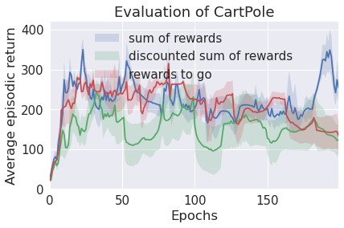

### Policy Gradient

The implementation of the vanilla Policy Gradient algorithm (or REINFORCE). Since, the introduction of the REINFORCE algorithms several different baselines have been proposed to reduce the variance and increase the convergence of the algorithm. Several different baselines have been evaluated on the CartPole environment, 

