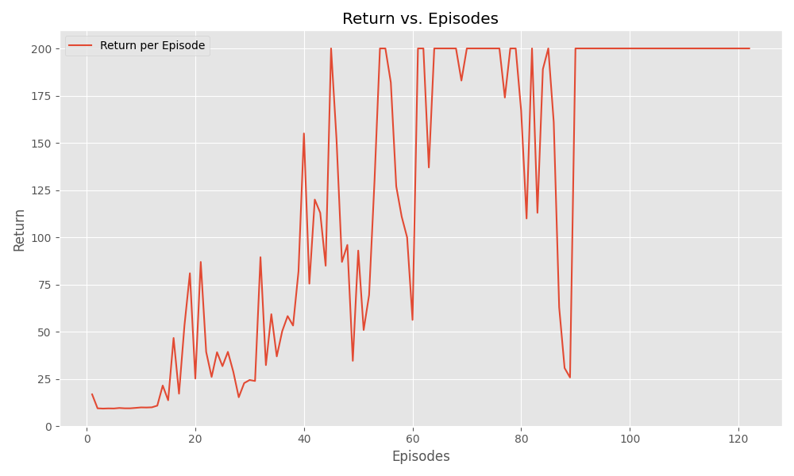

# Meta-Reinforcement Learning Algorithms
A PyTorch implementation of meta-reinforcement learning algorithms, RL^2 PPO, MGRL, SNAIL, and VariBAD. 

TODO

## Setup
Install the packages using the `requirements.txt` file.

```bash
# using conda
conda create --name meta_rl --file requirements.txt
# Or pip
pip install requirements.txt
```

## Usage
Run experiments by using the following example command:

```bash
python main.py --name experiment_name -c configs/rl2_ppo.yml
```


## Algorithms

- [x] RL^2 Proximal Policy Optimization (PPO)
- [x] Meta-Gradient Reinforcement Learning (A2C)
- [ ] VariBAD
- [ ] SNAIL

Ideas for:
- Proximal Policy Optimization with Episodic Planning Networks (EPNs)


## Results
Initial results showing the convergence of meta-gradient reinforcement learning with A2C. The inner-loop optimizes on the CartPole environment and in the outer-loop the gamma value is cross-validated and updated by gradient descent. The current setting shows similar performance to the regular A2C algorithm and the implementation might benefit from conditioning the value and policy on gamma value embeddings.



## References
- Achiam, J. (2018). Spinning Up in Deep Reinforcement Learning. https://spinningup.openai.com/en/latest/index.html
- Wang, J. X., Kurth-Nelson, Z., Tirumala, D., Soyer, H., Leibo, J. Z., Munos, R., Blundell, C., Kumaran, D., & Botvinick, M. (2017). Learning to reinforcement learn. ArXiv:1611.05763 [Cs, Stat]. http://arxiv.org/abs/1611.05763
- Duan, Y., Schulman, J., Chen, X., Bartlett, P. L., Sutskever, I., & Abbeel, P. (2016). RL$^2$: Fast Reinforcement Learning via Slow Reinforcement Learning (arXiv:1611.02779). arXiv. https://doi.org/10.48550/arXiv.1611.02779
- Zintgraf, L., Shiarlis, K., Igl, M., Schulze, S., Gal, Y., Hofmann, K., & Whiteson, S. (2020). VariBAD: A Very Good Method for Bayes-Adaptive Deep RL via Meta-Learning (arXiv:1910.08348). arXiv. https://doi.org/10.48550/arXiv.1910.08348
- Mishra, N., Rohaninejad, M., Chen, X., & Abbeel, P. (2018). A Simple Neural Attentive Meta-Learner (arXiv:1707.03141). arXiv. http://arxiv.org/abs/1707.03141